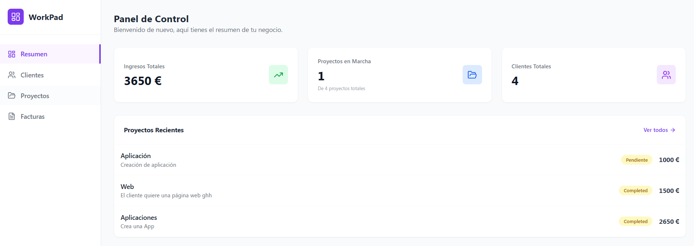
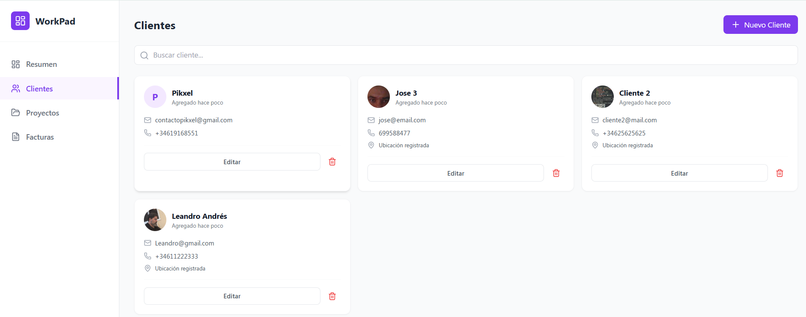

# WorkPad

> CRM/ERP moderno para autónomos y agencias digitales. Gestiona clientes, proyectos y facturación desde una única plataforma con métricas en tiempo real.

---

## Tabla de Contenidos

- [Demo y Capturas](#demo-y-capturas)
- [Requisitos Funcionales](#requisitos-funcionales)
- [Tecnologías Utilizadas](#tecnologías-utilizadas)
- [Arquitectura del Proyecto](#arquitectura-del-proyecto)
- [Requisitos Previos](#requisitos-previos)
- [Instalación](#instalación)
- [Variables de Entorno](#variables-de-entorno)
- [Estructura de la Base de Datos](#estructura-de-la-base-de-datos)
- [Uso de la Aplicación](#uso-de-la-aplicación)
- [Características Destacadas](#características-destacadas)
- [Licencia](#licencia)
- [Autor y Contacto](#autor-y-contacto)

---
## Demo y Capturas

### Dashboard Principal



### Gestión de Clientes



### Generación de Facturas PDF


## Requisitos Funcionales

WorkPad implementa las siguientes funcionalidades clave:

### Autenticación y Seguridad

- Sistema de registro e inicio de sesión con email/password
- Persistencia de sesión mediante tokens JWT
- Rutas protegidas que redirigen automáticamente al login si el usuario no está autenticado
- Cierre de sesión seguro con limpieza de estado

### Dashboard Interactivo

- Visualización de métricas en tiempo real:
  - Total de ingresos generados
  - Número de proyectos activos
  - Clientes registrados en el sistema
- Gráficos y estadísticas actualizadas dinámicamente

### Gestión Completa de Clientes (CRUD)

- Crear nuevos clientes con datos detallados
- Subida y almacenamiento de logos/imágenes corporativas
- Campos de geolocalización (dirección, ciudad, código postal)
- Edición y eliminación de registros existentes
- Listado con búsqueda y filtrado

### Administración de Proyectos

- Creación de proyectos vinculados a clientes específicos
- Sistema de estados: **Pendiente**, **En Progreso**, **Pagado**
- Seguimiento del progreso mediante cambios de estado
- Relación bidireccional cliente-proyecto

### Sistema de Facturación

- Generación automática de facturas vinculadas a proyectos
- Cálculo automático de importes totales
- **Descarga de facturas en formato PDF** listas para imprimir
- Numeración automática y datos fiscales completos

### Diseño Responsive

- Interfaz adaptable a dispositivos móviles, tablets y desktop
- Experiencia de usuario optimizada para cualquier tamaño de pantalla

---

## Tecnologías Utilizadas

### Frontend

| Tecnología              | Versión | Descripción                                              |
| ----------------------- | ------- | -------------------------------------------------------- |
| **React**               | 18.x    | Biblioteca principal para la construcción de la interfaz |
| **Vite**                | Latest  | Herramienta de build ultrarrápida para desarrollo        |
| **React Router Dom**    | v6      | Sistema de enrutamiento con protección de rutas          |
| **Tailwind CSS**        | Latest  | Framework de estilos utilitarios para diseño moderno     |
| **React Hook Form**     | Latest  | Gestión eficiente de formularios y validación            |
| **Lucide React**        | Latest  | Iconografía moderna y personalizable                     |
| **@react-pdf/renderer** | Latest  | Generación de documentos PDF desde React                 |

### Backend

| Servicio             | Función                                        |
| -------------------- | ---------------------------------------------- |
| **Supabase**         | Plataforma principal de backend                |
| **PostgreSQL**       | Base de datos relacional gestionada            |
| **Supabase Auth**    | Sistema de autenticación robusto               |
| **Supabase Storage** | Almacenamiento de archivos (logos de clientes) |

### Herramientas de Desarrollo

- **ESLint** - Linting de código JavaScript/React
- **PostCSS** - Procesamiento de CSS con Tailwind
- **Git** - Control de versiones

---

## Arquitectura del Proyecto

```
workpad-web/
│
├── src/
│   ├── components/         # Componentes reutilizables
│   │   ├── layout/         # Layout principal y navegación
│   │   ├── clients/        # Componentes de gestión de clientes
│   │   ├── projects/       # Componentes de proyectos
│   │   └── invoices/       # Componentes de facturación
│   │
│   ├── pages/              # Vistas principales (Dashboard, Login, etc.)
│   ├── services/           # Lógica de conexión con Supabase
│   ├── hooks/              # Custom hooks de React
│   ├── utils/              # Funciones auxiliares
│   ├── config/             # Configuración de Supabase
│   ├── App.jsx             # Componente raíz con rutas
│   └── main.jsx            # Punto de entrada de la aplicación
│
├── public/                 # Recursos estáticos
├── .env                    # Variables de entorno (NO incluir en Git)
├── .env.example            # Plantilla de variables de entorno
├── package.json            # Dependencias del proyecto
├── vite.config.js          # Configuración de Vite
├── tailwind.config.js      # Configuración de Tailwind CSS
└── README.md               # Este archivo
```

---

## Requisitos Previos

- **Node.js** versión 16.x o superior
- **NPM** versión 8.x o superior
- **Git** para clonar el repositorio
- Una cuenta en **Supabase**

Verifica las versiones instaladas ejecutando:

```bash
node --version
npm --version
git --version
```

---

## Instalación

Sigue estos pasos para configurar el proyecto en tu entorno local:

### 1. Clonar el Repositorio

```bash
git clone https://github.com/Ari-dev-design/workpad-web.git
cd workpad-web
```

### 2. Instalar Dependencias

```bash
npm install
```

Este comando instalará todas las librerías necesarias especificadas en `package.json`.

### 3. Configurar Variables de Entorno

Crea un archivo `.env` en la raíz del proyecto (ver siguiente sección para detalles):

```bash
cp .env.example .env
```

Edita el archivo `.env` con tus credenciales de Supabase.

### 4. Iniciar el Servidor de Desarrollo

```bash
npm run dev
```

La aplicación estará disponible en: **http://localhost:5173**

### 5. Compilar para Producción (Opcional)

```bash
npm run build
```

Los archivos optimizados se generarán en la carpeta `dist/`.

---

## Variables de Entorno

WorkPad requiere las siguientes variables de entorno para funcionar correctamente. Crea un archivo `.env` en la raíz del proyecto con este contenido:

```env
# URL de tu proyecto en Supabase
VITE_SUPABASE_URL=https://tu-proyecto.supabase.co

# Clave pública (anon key) de Supabase
VITE_SUPABASE_KEY=tu-clave-publica-aqui
```

### ¿Dónde obtener estas credenciales?

1. Accede a tu proyecto en [Supabase Dashboard](https://app.supabase.com/)
2. Ve a **Settings** → **API**
3. Copia:
   - **Project URL** → `VITE_SUPABASE_URL`
   - **anon/public key** → `VITE_SUPABASE_KEY`

**IMPORTANTE**: Nunca subas el archivo `.env` a Git. Asegúrate de que esté incluido en `.gitignore`.

---

## Estructura de la Base de Datos

WorkPad utiliza las siguientes tablas en PostgreSQL (gestionadas por Supabase):

### Tabla: `clients`

```sql
- id (uuid, primary key)
- user_id (uuid, foreign key a auth.users)
- name (text)
- email (text)
- phone (text)
- address (text)
- city (text)
- postal_code (text)
- logo_url (text)
- created_at (timestamp)
```

### Tabla: `projects`

```sql
- id (uuid, primary key)
- user_id (uuid, foreign key a auth.users)
- client_id (uuid, foreign key a clients)
- title (text)
- description (text)
- budget (numeric)
- status (text: 'Pendiente' | 'En Progreso' | 'Pagado')
- created_at (timestamp)
```

### Tabla: `invoices`

```sql
- id (uuid, primary key)
- user_id (uuid, foreign key a auth.users)
- project_id (uuid, foreign key a projects)
- invoice_number (text)
- amount (numeric)
- issue_date (date)
- due_date (date)
- created_at (timestamp)
```

### Storage Bucket: `client-logos`

- Almacena las imágenes/logos de los clientes
- Configurado con acceso público para lectura
- Tamaño máximo de archivo: 2MB

**Tip**: Puedes importar el esquema SQL desde el archivo `database/schema.sql` (si lo incluyes en el proyecto).

---

## Uso de la Aplicación

### 1. Registro e Inicio de Sesión

- Accede a la página de Login
- Crea una cuenta con email y contraseña
- Inicia sesión para acceder al sistema

### 2. Añadir Clientes

- Ve a la sección **Clientes**
- Haz clic en **+ Nuevo Cliente**
- Rellena el formulario con los datos del cliente
- (Opcional) Sube un logo corporativo
- Guarda el cliente

### 3. Crear Proyectos

- Accede a **Proyectos** → **Crear Proyecto**
- Selecciona el cliente asociado
- Define el título, descripción y presupuesto
- Establece el estado inicial (Pendiente/En Progreso)
- Guarda el proyecto

### 4. Generar Facturas

- Ve a **Facturación** → **Nueva Factura**
- Selecciona el proyecto a facturar
- El sistema calculará automáticamente el importe
- Haz clic en **Descargar PDF** para obtener la factura

### 5. Seguimiento en Dashboard

- El Dashboard muestra en tiempo real:
  - Ingresos totales
  - Proyectos activos
  - Últimos movimientos

---

## Características Destacadas

### Rendimiento Optimizado

- Build con Vite para cargas ultrarrápidas
- Code splitting automático
- Lazy loading de componentes

### Seguridad Implementada

- Autenticación mediante JWT
- Row Level Security (RLS) en Supabase
- Validación de formularios en cliente y servidor

### Diseño Profesional

- Sistema de diseño consistente con Tailwind
- Interfaz intuitiva y moderna
- Animaciones suaves y transiciones

### Generación de PDFs Avanzada

- Facturas profesionales con datos fiscales
- Descarga instantánea sin backend adicional
- Formato estándar listo para imprimir

---

## Licencia

Este proyecto está bajo la Licencia **MIT**.

```
MIT License

Copyright (c) 2025 Ari-dev-design


---

## Autor y Contacto

**Desarrollado por:** Ari-dev-design  
**Repositorio GitHub:** [https://github.com/Ari-dev-design/workpad-web](https://github.com/Ari-dev-design/workpad-web)

### Contacto

- **GitHub:** https://github.com/Ari-dev-design
- **Email:** aridaneq@gmailc.com
- **Dominio** QueCa.dev
- **Vercel** https://workpad-web.vercel.app

---

## Agradecimientos

Este proyecto fue desarrollado como Trabajo de Fin de Módulo para el ciclo de **Desarrollo de Aplicaciones Web**.

Agradecimientos especiales a:

- La comunidad de **React** y **Supabase**
- Los creadores de las librerías open-source utilizadas
- Tutores y compañeros del módulo formativo

---

<div align="center">

**Si te ha gustado este proyecto, dale una estrella en GitHub**

Hecho con dedicación por Ari-dev-design

</div>
