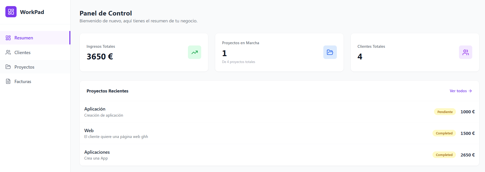
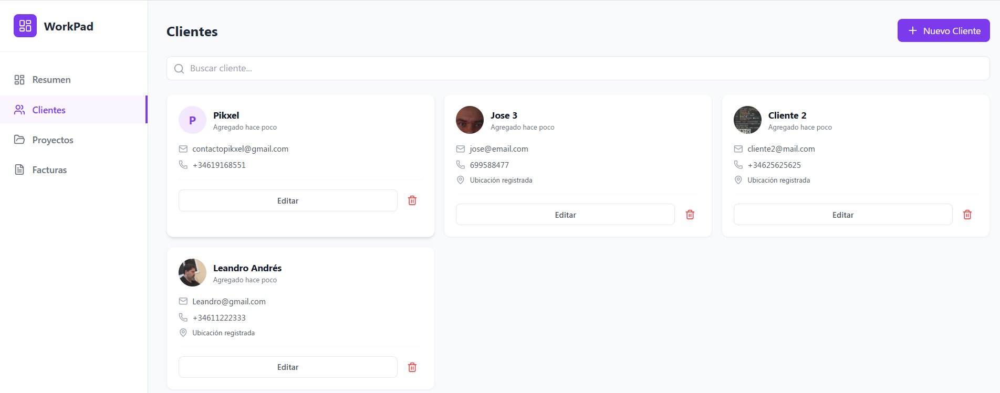
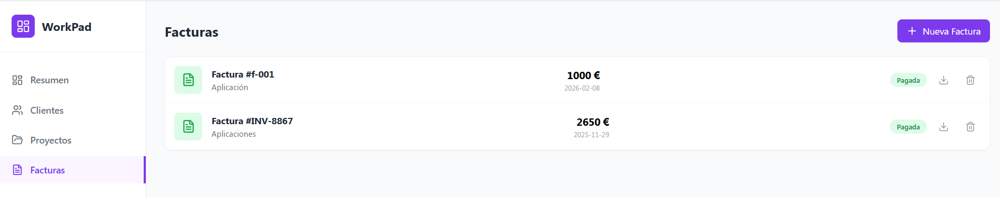

# WorkPad

> CRM/ERP moderno para autónomos y agencias digitales. Gestiona clientes, proyectos y facturación desde una única plataforma con métricas en tiempo real.

---

## Tabla de Contenidos

- [Demo y Capturas](#demo-y-capturas)
- [Requisitos Funcionales](#requisitos-funcionales)
- [Tecnologías Utilizadas](#tecnologías-utilizadas)
- [Arquitectura del Proyecto](#arquitectura-del-proyecto)
- [Requisitos Previos](#requisitos-previos)
- [Instalación](#instalación)
- [Variables de Entorno](#variables-de-entorno)
- [Estructura de la Base de Datos](#estructura-de-la-base-de-datos)
- [Uso de la Aplicación](#uso-de-la-aplicación)
- [Limitaciones Conocidas](#limitaciones-conocidas)
- [Licencia](#licencia)
- [Autor y Contacto](#autor-y-contacto)

---

## Demo y Capturas

### Dashboard Principal


_Panel principal con métricas en tiempo real: ingresos, proyectos activos y clientes._

### Gestión de Clientes


_Listado de clientes con buscador, logos y ubicación en mapa._

### Generación de Facturas PDF


_Listado de facturas con descarga de PDF disponible para facturas pagadas._

---

## Requisitos Funcionales

### Autenticación y Seguridad

- Registro e inicio de sesión con email y contraseña
- Persistencia de sesión con localStorage (`user_workpad`)
- Rutas protegidas que redirigen al login si no hay sesión activa
- Cierre de sesión con limpieza de estado y localStorage

### Dashboard

- Ingresos totales calculados desde facturas con estado "Pagado"
- Proyectos activos en estado "En Progreso"
- Total de clientes registrados
- Lista de los 3 proyectos más recientes con badge de estado

### Gestión de Clientes (CRUD completo)

- Crear, editar y eliminar clientes
- Subida de logo corporativo (JPG/PNG, con validación de tipo)
- Mapa interactivo con Leaflet para fijar la ubicación del cliente
- Buscador en tiempo real por nombre

### Gestión de Proyectos (CRUD completo)

- Crear, editar y eliminar proyectos
- Vinculación con cliente mediante selector dinámico
- Estados: Pendiente, En Progreso, Pagado, Cancelado
- Fecha de entrega y precio por proyecto
- Buscador en tiempo real por título

### Sistema de Facturación (CRUD completo)

- Crear, editar y eliminar facturas
- Numeración auto-generada con formato: `PREFIJO-MMAA-SEQ`
- Descarga en PDF únicamente si la factura está en estado "Pagado"
- Vinculación con proyecto mediante selector dinámico

### Diseño Responsive

- Sidebar fijo en escritorio, barra horizontal en móvil
- Grids adaptables: 1 columna móvil → 2 tablet → 3 escritorio

---

## Tecnologías Utilizadas

### Frontend

| Tecnología              | Versión | Descripción                                        |
| ----------------------- | ------- | -------------------------------------------------- |
| **React**               | 19.x    | Biblioteca principal para la construcción de la UI |
| **Vite**                | 7.x     | Herramienta de build para desarrollo               |
| **React Router Dom**    | v7      | Enrutamiento con protección de rutas               |
| **Tailwind CSS**        | 3.x     | Framework de estilos utilitarios                   |
| **React Hook Form**     | 7.x     | Gestión de formularios y validación                |
| **Lucide React**        | 0.563.x | Iconografía                                        |
| **@react-pdf/renderer** | 4.x     | Generación de facturas en PDF                      |
| **React Leaflet**       | 5.x     | Mapa interactivo para ubicación de clientes        |

### Backend

| Tecnología           | Descripción                                         |
| -------------------- | --------------------------------------------------- |
| **PostgreSQL**       | Base de datos relacional gestionada por Supabase    |
| **Supabase**         | Backend as a Service (BaaS)                         |
| **Supabase Auth**    | Autenticación de usuarios con JWT y políticas RLS   |
| **Supabase Storage** | Almacenamiento de logos de clientes (bucket: logos) |

### Herramientas de Desarrollo

- **ESLint** — Linting de código JavaScript/React
- **PostCSS + Autoprefixer** — Procesamiento de CSS con Tailwind
- **Git** — Control de versiones
- **Vercel** — Despliegue en producción

---

## Arquitectura del Proyecto

```
workpad-web/
│
├── node_modules/
├── public/
│   └── vite.svg
├── screenshots/                    # Capturas para el README
│
├── src/
│   ├── assets/
│   │   └── react.svg
│   ├── components/
│   │   ├── layout/
│   │   │   ├── Layout.jsx          # Estructura principal con Sidebar
│   │   │   ├── ProtectedRoute.jsx  # Protección de rutas privadas
│   │   │   └── Sidebar.jsx         # Navegación lateral/horizontal
│   │   └── pdf/
│   │       └── InvoiceDocument.jsx # Plantilla PDF de facturas
│   ├── context/
│   │   └── AuthContext.jsx         # Estado global de autenticación
│   ├── pages/
│   │   ├── auth/
│   │   │   ├── Login.jsx
│   │   │   └── Register.jsx
│   │   ├── clients/
│   │   │   ├── Clients.jsx         # Listado de clientes
│   │   │   └── ClientForm.jsx      # Crear/editar cliente con mapa
│   │   ├── dashboard/
│   │   │   └── Dashboard.jsx       # Panel de métricas
│   │   ├── invoices/
│   │   │   ├── Invoices.jsx        # Listado de facturas
│   │   │   └── InvoiceForm.jsx     # Crear/editar factura
│   │   └── projects/
│   │       ├── Projects.jsx        # Listado de proyectos
│   │       └── ProjectForm.jsx     # Crear/editar proyecto
│   ├── services/
│   │   └── api.js                  # Todas las llamadas a Supabase
│   ├── App.css
│   ├── App.jsx                     # Componente raíz y enrutador
│   ├── index.css
│   └── main.jsx                    # Punto de entrada
│
├── .env                            # Variables de entorno (NO subir a Git)
├── .gitignore
├── eslint.config.js
├── index.html
├── package-lock.json
├── package.json
├── postcss.config.js
├── README.md
├── supabase_setup.sql              # Script SQL para configurar Supabase
├── tailwind.config.js
├── vercel.json                     # Configuración de despliegue en Vercel
├── vite.config.js
└── WorkPad.fig                     # Archivo de diseño Figma
```

---

## Requisitos Previos

- **Node.js** versión 18.x o superior
- **NPM** versión 9.x o superior
- **Git** para clonar el repositorio
- Una cuenta en **Supabase**

```bash
node --version
npm --version
git --version
```

---

## Instalación

### 1. Clonar el Repositorio

```bash
git clone https://github.com/Ari-dev-design/workpad-web.git
cd workpad-web
```

### 2. Instalar Dependencias

```bash
npm install
```

### 3. Configurar Variables de Entorno

```bash
cp .env.example .env
```

Edita el archivo `.env` con tus credenciales de Supabase.

### 4. Configurar la Base de Datos

Ejecuta el archivo `supabase_setup.sql` en el editor SQL de tu proyecto Supabase para activar las políticas RLS.

### 5. Iniciar el Servidor de Desarrollo

```bash
npm run dev
```

La aplicación estará disponible en: **http://localhost:5173**

### 6. Compilar para Producción (Opcional)

```bash
npm run build
```

---

## Variables de Entorno

Crea un archivo `.env` en la raíz con este contenido:

```env
VITE_SUPABASE_URL=https://tu-proyecto.supabase.co
VITE_SUPABASE_ANON_KEY=tu-clave-publica-aqui
```

### ¿Dónde obtener estas credenciales?

1. Accede a tu proyecto en [Supabase Dashboard](https://app.supabase.com/)
2. Ve a **Settings** → **API**
3. Copia **Project URL** → `VITE_SUPABASE_URL`
4. Copia **anon/public key** → `VITE_SUPABASE_ANON_KEY`

> **IMPORTANTE**: El archivo `.env` está incluido en `.gitignore` y nunca debe subirse al repositorio.

---

## Estructura de la Base de Datos

WorkPad usa PostgreSQL a través de Supabase con RLS activado. Cada usuario solo ve sus propios datos gracias a las políticas `USING (user_id = auth.uid())`.

### Tabla: `clientes`

```sql
- id          (uuid, primary key)
- user_id     (uuid, foreign key → auth.users)
- nombre      (text)
- email       (text)
- telefono    (text)
- lat         (numeric)
- lng         (numeric)
- logo_url    (text)
- created_at  (timestamp)
```

### Tabla: `proyectos`

```sql
- id          (uuid, primary key)
- user_id     (uuid, foreign key → auth.users)
- client_id   (uuid, foreign key → clientes)
- title       (text)
- description (text)
- price       (numeric)
- deadline    (date)
- status      (text: 'Pendiente' | 'En Progreso' | 'Pagado' | 'Cancelado')
- created_at  (timestamp)
```

### Tabla: `facturas`

```sql
- id          (uuid, primary key)
- user_id     (uuid, foreign key → auth.users)
- project_id  (uuid, foreign key → proyectos)
- number      (text)
- amount      (numeric)
- date        (date)
- status      (text: 'Pendiente' | 'Pagado')
- created_at  (timestamp)
```

### Storage Bucket: `logos`

- Almacena los logos de los clientes
- Acceso público para lectura
- Solo se aceptan imágenes JPG y PNG

---

## Uso de la Aplicación

### 1. Registro e Inicio de Sesión

- Accede a `/login`
- Crea una cuenta con email y contraseña (mínimo 6 caracteres)
- Inicia sesión para acceder al sistema

### 2. Añadir Clientes

- Ve a **Clientes** → **Nuevo Cliente**
- Rellena nombre, email y teléfono (9 dígitos)
- Sube un logo opcional (JPG/PNG)
- Haz clic en el mapa para fijar la ubicación
- Guarda el cliente

### 3. Crear Proyectos

- Ve a **Proyectos** → **Nuevo Proyecto**
- Selecciona el cliente en el desplegable
- Define título, descripción, precio y fecha de entrega
- Establece el estado inicial
- Guarda el proyecto

### 4. Generar Facturas

- Ve a **Facturas** → **Nueva Factura**
- Selecciona el proyecto a facturar
- El número se genera automáticamente
- Introduce el importe y la fecha
- Cuando el estado sea **Pagado** aparece el botón de descarga PDF

### 5. Seguimiento en Dashboard

- Consulta ingresos totales, proyectos activos y total de clientes
- Revisa los 3 proyectos más recientes desde el panel principal

---

## Limitaciones Conocidas

- No hay paginación en los listados (se cargan todos los registros)
- El PDF de factura no incluye datos fiscales del emisor (NIF, dirección)
- No existe recuperación de contraseña por email
- No se validan nombres duplicados de clientes

---

## Licencia

Este proyecto está bajo la Licencia **MIT**.

```
MIT License
Copyright (c) 2025 Ari-dev-design
```

---

## Autor y Contacto

**Desarrollado por:** Ari-dev-design

- **GitHub:** https://github.com/Ari-dev-design
- **Email:** aridaneq@gmail.com
- **Vercel:** https://workpad-web.vercel.app

---

## Agradecimientos

Este proyecto fue desarrollado como Trabajo de Fin de Módulo para el ciclo de **Desarrollo de Aplicaciones Web**.

Agradecimientos especiales a:

- La comunidad de **React** y **Supabase**
- Los creadores de las librerías open-source utilizadas
- Tutores y compañeros del módulo formativo.

---

**Si te ha gustado este proyecto, dale una estrella en GitHub**
